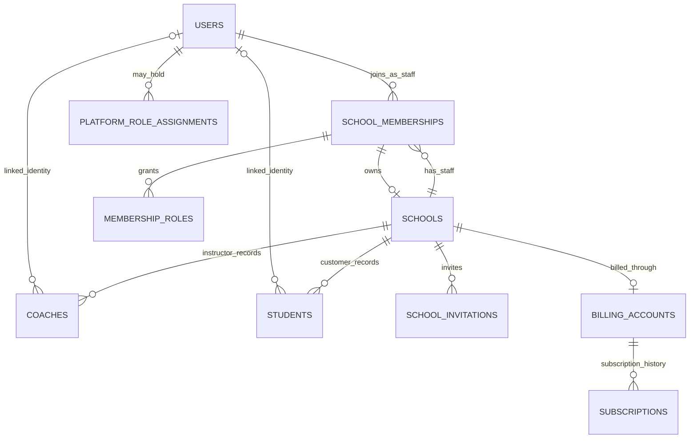

# Registration, school membership and ownership

8 September 2026. Status: accepted by the owner as the target registration and identity design; implementation is pending. This defines the model and journeys for the [development plan](DEVELOPMENT_PLAN.md) and refines the identity section of the [commercial architecture](COMMERCIAL_AND_PRIVACY_ARCHITECTURE.md). The [implementation roadmap](IMPLEMENTATION_ROADMAP.md) records delivery tasks, S/M/L estimates, dependencies, migration/cutover steps and launch gates. Table names below describe a target model, not an executable migration. This approval records the design; provider purchases, final commercial values and release deployment follow their separate task decisions.

A3 implementation decision, 9 September: [retain the current account/session foundation](AUTH_EMAIL_AND_JOBS_DECISION.md), with password, verification/recovery and MFA work in B3/B9. Mailjet and a Neon outbox handle planned transactional delivery, starting with Mailjet Free for the pilot. B1/B2 preserve user IDs and existing login compatibility. Provider setup is pending and does not block the additive schema work.

## Accepted model

A person registers once. Their personal account works independently of a school. School staff access, school ownership and subscriptions are separate relationships.

A user can learn at several schools, instruct at one and administer another. They can be both instructor and administrator at the same school. Buying a subscription does not promote a person or grant access to an existing school. It activates features for a school they already have authority to manage.

Create a draft school before checkout. Let the owner complete setup and start a trial before requiring payment. The existing commercial proposal recommends a 30-day trial without a card; duration and access remain catalogue configuration to approve before launch. The trial begins on explicit workspace activation, not personal registration. Creating a draft must not automatically publish a school listing. Limit draft creation and repeat trials to control abuse.

A school has one accountable workspace owner at launch, several possible administrators and several instructors. Workspace ownership grants management and billing authority. Teaching is an explicit additional role, including for an owner. This is application authority; creating a workspace is not proof of legal ownership of an existing real-world business.

## Example

| Person | Personal activity | School A | School B |
| --- | --- | --- | --- |
| Ana | Books lessons | Owner and instructor | Customer |
| Miguel | Checks forecasts and books lessons | Administrator and instructor | Instructor |
| Sofia | Books lessons | Customer | Customer |

All three have one login each. Customer relationships do not grant staff membership. Miguel's permissions at School A do not apply at School B. A paid subscription belongs to the relevant school, so Miguel does not need to purchase one personally to teach there.

## Registration journeys

### Surfer

1. Browse the public forecast and lessons when the planned public-access release is available. Forecast access policy is independent of identity and can change without another account model.
2. Choose a lesson or create an account. Ask for name, email and password, then verify email. Keep existing username login for legacy accounts; new registrations need not choose a username. Telephone, experience and preferences are collected when needed.
3. Record terms acceptance and privacy-notice delivery separately, with optional choices separate, as specified in the privacy proposal.
4. Return to the selected spot, day or lesson. Do not discard the original task during verification.
5. On booking, create or reuse a school-scoped student/customer record linked to the authenticated user. Booking an eligible public lesson does not require staff membership or admin approval. Private/invitation-only lessons retain their eligibility rules.

Initial scope is adults booking for themselves. The later guardian/participant model must distinguish the purchasing account from a child or other attendee before family bookings are enabled.

### School owner

1. Register or log in with the same personal account, then choose Create a school.
2. Enter the school name, location/timezone, contact details and teaching spots. Create the draft school and its owner membership in one transaction.
3. If a matching school already exists, offer Request access or Claim this school. Do not attach the person to it merely because they know its name, use its email domain or pay. Resolve an existing owner's approval or platform-assisted evidence review first.
4. Choose Start trial to activate the management workspace. Use a short setup checklist: complete school details, invite an instructor or mark oneself as an instructor, create the first lesson and publish the school/schedule deliberately.
5. Subscribe from School settings → Plan and billing. Checkout references that school's billing account. Verified payment events activate its entitlements; cancellation does not delete its workspace.

The school remains the billing customer if its owner changes. A personal card payer is not automatically the school owner. An incomplete or failed checkout does not leave an ownerless school or grant paid features. Before billing ships, pilot access can use explicit time-bounded platform grants rather than pretending a payment exists.

### Instructor

1. A school owner or authorised administrator selects Invite instructor and enters an email address. If the person has no account, the invitation lets them register and verify that address. If they have one, they log in and accept using the matching verified identity.
2. Acceptance creates or activates the school membership, adds its instructor role and links a school-specific instructor record. There is no global promotion from surfer to coach.
3. The instructor sees My teaching and the appropriate school workspace. They can still use forecasts and book lessons as a surfer.
4. An instructor who registers before receiving an invitation can complete a personal teaching profile and request to join a school. A request grants no access until the school approves and the person accepts the affiliation.
5. A solo instructor who sells their own lessons follows school setup for a one-person business. They become its owner and explicitly enable their instructor role. This reuses subscriptions, products and payment configuration.

A school may keep a provisional instructor record for planning before invitation acceptance. That record alone never creates a login or grants access. Public association and any instructor ranking/profile publication follow the person's visibility choices.

### Administrator and combined roles

The owner can invite an administrator or grant administration to an existing staff member. An administrator can invite instructors and manage teaching operations, but cannot appoint other administrators, transfer ownership or control subscription/payout settings in the first version. Those remain owner actions. This keeps the initial permissions understandable; a separate billing role can be added later if needed.

For each accepted staff member, show two independent choices: Manage school and Teach lessons. Both can be enabled. In the UI use Administrator and Instructor; retain the existing `coach` identifier internally during migration if that avoids unnecessary renaming.

An owner who teaches has owner authority plus the instructor role. An administrator with the instructor role appears in lesson assignment lists. Administration alone does not make someone an assignable teacher or imply any teaching qualification.

## Permission model

| Action | Personal account/customer | Instructor | Administrator | Owner |
| --- | --- | --- | --- | --- |
| Forecasts and own bookings | Yes | Yes | Yes | Yes |
| Own personal account and password | Yes | Yes | Yes | Yes |
| Assigned lesson details and required attendee information | Own booking only | Assigned lessons | School's lessons | School's lessons |
| Create/edit teaching sessions | No | Own assigned sessions, within school policy | School-wide | School-wide |
| Assign other instructors, manage customers and operational bookings | No | Limited attendee/attendance actions on assigned lessons | School-wide | School-wide |
| Invite/remove instructor access | No | No | Yes, own school | Yes, own school |
| Appoint/remove administrators | No | No | No | Yes |
| Plan, billing, payout configuration and ownership transfer | No | No | No | Yes |
| Become assignable as instructor | No | Yes | Only with instructor role | Only with instructor role |
| Manage global surf spots/calibrations | No | No | No | No |

Platform administration remains a separate, tightly controlled assignment. School ownership cannot grant it. Support access to school-private records should be explicit and audited; normal school workflows must not require platform authority.

Roles supply capabilities; resource relationships limit their scope. An instructor must actually be assigned to the requested lesson in the same school. Personal bookings use the verified user link, not an email supplied in the request. Subscription entitlements determine whether a permitted operation is commercially available. Apply these checks on every server request, deny missing grants, and test ID/filter tampering. This follows [OWASP's authorisation guidance](https://cheatsheetseries.owasp.org/cheatsheets/Authorization_Cheat_Sheet.html).

Scope must also be enforced by joins and database relationships. Teacher assignment and student booking records must belong to the lesson's school. Browser-selected school context is a convenience, never an authority. Suspension overrides the roles on that membership. Removing staff access must not erase personal bookings, disable the global account or affect work at another school.

School admins can edit school-held operational customer/instructor records, but cannot change a person's global email, password, consent, account status or other-school data. A person controls their global account. Only a separate platform process may disable it globally. This changes the current admin-created-account workflow substantially.

## Target data model

| Record | Proposed fields and rules |
| --- | --- |
| `users` | Global ID, name, email, optional legacy username, credentials/provider identity, verification time, personal profile, disabled/deleted status and auth version. No authoritative school ID or school role. Active email uniqueness remains global. |
| `school_memberships` | ID, school ID, user ID, status (`active`, `suspended`, `left`), created/updated times. Unique `(school_id, user_id)`; reactivate the same relationship through an authorised flow. Pending invitations are separate, not active memberships. |
| `membership_roles` | Membership ID, role (`school_admin`, `coach` initially), grant actor/time. Unique `(membership_id, role)`. Multiple roles allowed. Role vocabulary and permission rules remain in code; assignments are data. Owner authority is derived from ownership, not duplicated in this table. |
| `schools` | Existing ID/details plus workspace lifecycle (`draft`, `active`, `suspended`, `closed`), separate listing publication state and `owner_membership_id`. One owner for each self-service school, in the same school and with active membership. Existing ownerless legacy records stay outside self-service activation until their owner is resolved. |
| `school_invitations` | ID, school ID, normalised invited email, requested roles, inviter, hashed token, expiry, status, acceptance user/time; optional explicit legacy instructor/student record link. Requested roles use a constrained child table or validated fixed-role values. |
| `school_join_requests` | ID, school ID, applicant user ID, requested role, pending/approved/declined/withdrawn status, decision actor/time. No permission until approved and affiliation accepted. Defer this table until request-to-join UX ships. |
| `coaches` | Keep existing school-specific instructor IDs and lesson links. Optional user ID; unique active `(school_id, user_id)` instead of global uniqueness. A linked record is assignable as an active staff instructor only with active membership and instructor role. Provisional records remain explicitly distinguishable. |
| `students` | Keep school-specific customer/attendee IDs and booking history. Optional user ID; unique active `(school_id, user_id)` for the initial adult-self-booking scope. Not a staff role. School-private notes remain here or in appropriately restricted related records. |
| `platform_role_assignments` | User ID, platform role, grant actor/time, revocation time. No public registration or school-role endpoint can write it. |
| `billing_accounts` | One school billing account for school SaaS, independent of its owner. Existing commercial proposal also permits a separately scoped personal billing account for future surfer products. Never infer school roles from billing IDs. |
| `subscriptions` | Billing account, immutable plan/price version, provider references, lifecycle/trial/period fields. Retain history; enforce one effective school SaaS subscription at a time and idempotent checkout creation. |
| `auth_sessions`, verification/recovery tokens, audit records | Keep revocable global sessions; authorise membership against current database state. Add expiring single-use hashed email/recovery tokens and membership/invitation/ownership audit events. Never log raw tokens or passwords. |

Implement the ownership relationship with a composite foreign key from `(schools.id, owner_membership_id)` to `(school_memberships.school_id, id)`, with the supporting unique constraint and deferred creation transaction. A simple user FK is not enough to prove the owner belongs to that school. Ownership transfer, leaving and suspension require transaction locks and a constraint/trigger that prevents an inactive or missing owner of an active self-service school. Closure and exceptional account-erasure handling need an explicit process, not an indefinitely blocked request. Historical/closed school records can retain an auditable former ownership reference.

School, membership and subscription statuses are separate: a trial ending changes commercial access, not membership or personal login eligibility. An owner/admin must still fulfil existing bookings and reach billing cancellation, exports and privacy controls. Staff quotas count distinct active memberships, not role rows, so an admin who also teaches counts once. Trial and entitlement values are configurable per the commercial plan; users cannot submit their own grants.

For subscription activation, process verified provider events and reconcile provider state. A browser success redirect does not prove payment. Duplicate/out-of-order events must not create another subscription or membership. [Stripe subscription events](https://docs.stripe.com/billing/subscriptions/webhooks) describe the asynchronous lifecycle; the school-ownership and trial rules here are our product proposal.

## Invitation and ownership rules

Use a high-entropy token, store only its hash and accept it once, atomically. Proposed invitation expiry: seven days. Keep tokens out of analytics, logs and referrers. Reissuing invalidates the earlier token. Acceptance requires login and the exact matching verified email; possession of a forwarded link alone is insufficient. Generic invitation responses should not reveal whether an email already has an account.

Recheck the inviter's current authority, the school's state and applicable staff limits at acceptance. An invitation created by a removed admin must not remain a path to access. Reject revoked/expired invitations and attempts to add platform roles. Acceptance can add explicitly approved roles but must not silently replace existing roles or reactivate a suspended membership. Suspended access requires a fresh owner-authorised decision. Concurrent acceptance must create only one membership/role and consume at most one quota place.

Link legacy instructor/customer records only through an authorised, school-specific claim with verified identity. Matching names or an unverified email string must never expose history. Where a duplicate or ambiguous record exists, hold it for resolution instead of merging automatically. For new self-booking, derive identity from the session and use `(school_id, user_id)`; separate customer email snapshots from account authentication.

Ownership transfer requires the current owner's recent authentication, an active target membership, and target acceptance. Transfer authority atomically and retain the school's billing account. The old owner keeps only explicitly agreed non-owner roles. An owner cannot simply leave while the school is active; offer transfer or closure, with a documented platform recovery path for an unavailable owner. An existing administrator must not be assumed to be the legal or authorised owner during migration.

## Changes needed in the current application

Reviewed against the repository schema and authentication/booking handlers on 8 September 2026. This was a code/document review, not a new live database audit.

- `users.role` currently holds one role and `users.school_id` one school. The schema requires a school for every non-platform user. Replace these as permission authorities with global users and memberships. Drop the old school-scope check only as part of the tested cutover.
- The current `users.school_id` FK cascades school deletion into users. Remove that relationship when identity becomes global; closing/deleting one school must never delete a global account.
- Both active coach/user and student/user unique indexes currently cover only `user_id`. Replace them with school-and-user uniqueness so one person can have records in several schools. Reconcile duplicates and old unlinked rows before adding new constraints.
- Session creation and lookup currently join the user's single school and reject non-platform users without one. Update session lookup and login eligibility to allow a healthy global account with no membership, and when one school closes. Preserve password hashes, session revocation and auth-version controls.
- API handlers and UI commonly read a single session role/school ID. Replace this with personal identity plus server-resolved school context and effective capabilities. Recheck memberships on requests; do not freeze school roles into long-lived cookies.
- People creation currently asks school admins for a user's role and password. Replace it with separate Invite staff and Add customer actions. Admins do not choose a colleague's global password or disable their whole account.
- Booking currently uses school and supplied email checks and email-based student upserts. Make self-booking identity-based, scope records to the lesson's school and prove capacity/duplicate behaviour under concurrency. Keep staff booking-on-behalf as a separately authorised action.
- Introduce ownership, invitations, email verification/recovery and the later billing/entitlement records. Existing school admin assignments are not evidence of ownership.
- Update school-scoped instructor assignment constraints and role-removal behaviour. Keep historical instructor links; prevent new assignments after staff removal and flag future lessons for reassignment.

## Screens and navigation

Use one sign-up and one login screen. Optional entry actions such as Find a lesson, Teach with a school or Create a school guide the next screen; they are not permanent account types. A person can choose another action later without registering again.

Keep Conditions first/default unless a lesson, invitation or setup link provides a specific next task. Add personal My bookings, My teaching when applicable, and School workspaces for staff. Switching between personal activity and a school must show which context is active. A combined admin/instructor sees both sets of useful actions; no logout or role-switch ceremony is required.

School settings contain Team, Plan and billing, School profile and Ownership with appropriate visibility. The team list shows accepted members, their independent roles, suspended access and pending invitations. Customer records are a separate task-oriented list. Account settings remain personal, with global security, preferences, consent and deletion controls.

The 9 September language requirement adds a visible, accessible switcher before and after login, including mobile navigation. Initial languages are English, European Portuguese and Spanish; French is optional. A9 introduces personal `preferred_locale` and a functional device preference, independently of school membership. Preserve the chosen language through signup, invitations, recovery and email return links; browser language is an initial default with English fallback. B10 reviews all pilot journeys before G1. UI language does not change teaching language, school timezone or country, and published legal acceptances record the exact language/version shown. Complete A8's EU location work before enabling real registration/onboarding.

## Implementation sequence and acceptance

1. Complete the current school-boundary/privacy audit and use this permission matrix as its target. Record differences that the identity migration must resolve; preserve existing legitimate access during the interim release.
2. Rehearse additive membership/platform-role tables and backfill existing roles and explicit coach/student links. Preserve user, lesson, booking and instructor IDs. Backfill proven role assignments only; require an explicit ownership decision for each legacy school. Keep unresolved claims and duplicates in a reconciliation report.
3. Cut over session/API/UI authorisation to memberships under controlled rollout, then remove the legacy role/school authorities and cascade dependency after validation. During transition do not union old and new permissions; keep one authoritative decision path. After multi-school accounts exist, a simple rollback to single-school code is unsafe, so document the migration rollback boundary.
4. Release independent account registration, email verification/recovery and invitation acceptance first. Test that a global account with no school can log in and book, and that one person can be a customer, instructor and admin in different contexts.
5. Add draft school creation, explicit owner appointment/transfer, setup checklist and staff administration. Begin with the authorised pilot access policy; add configurable school trials/subscriptions when the commercial phase is ready. Request-to-join can follow basic invitations.
6. Test staging journeys and migrations before any production cutover. Retain role-removal, session-revocation, CSRF and rate-limit tests.

Required scenarios include: two-school isolation; administrator plus instructor at one school; personal bookings surviving staff removal; active staff limits under concurrent acceptance; forwarded/expired/replayed invitations; revoked inviter authority; suspended membership not silently restored; school closure preserving personal/other-school access; duplicate/failed checkout; ownership transfer while another request tries to remove the owner; and unchanged forecast/student history after migration.

The unresolved provider, legal/age and commercial launch decisions remain in the implementation roadmap. Design acceptance does not select an authentication provider, publish legal policies, activate payments or change forecast access today.
